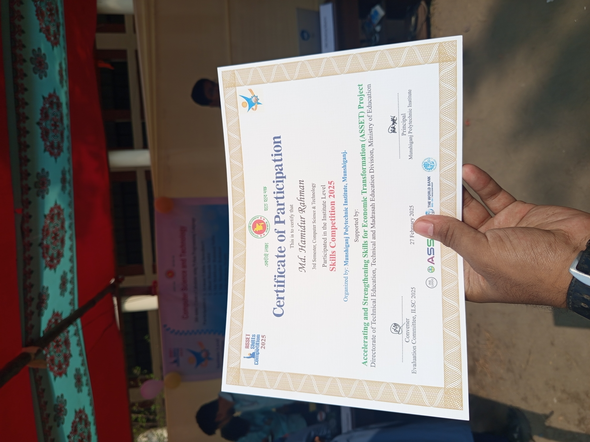

# Tkinter Calculator 🧮✨

A simple calculator GUI application built with Python's Tkinter library.  
Supports basic arithmetic, squares, cubes, roots, percentage, and Pi constant.

---

## ⚙️ Made for

**Rsset Skills Competition 2025**  
Held at **Munshiganj Polytechnic Institute** 🎓

---
## 🏆 Certificate


---
## 🚀 Features

- ➕➖✖️➗ Basic arithmetic operations  
- 🧑‍🔬 Square (x²) and cube (x³)  
- 🔺 Square root  
- 🥧 Pi constant insertion  
- 🧹 Clear last character (C) and clear all (AC)  
- ⚠️ Error handling for invalid inputs and division by zero  

## ▶️ How to Run
1. 📥 Download or clone the repository.
```bash
git clone https://github.com/hamidur0x/Rsset-skills-competition-2025.git
```
```bash
cd Rsset-skills-competition-2025
```


2. 📂 Make sure all the files are in the same directory as in the repository.
3. 🐍 Make sure you have Python installed (version 3.x).  
4. 💻 Run the script:

```bash
pip install tk
```
```bash
python calculator.py
```

**if it didn't run then maybe your machine need to create and activate virtual environment before installing the pip**
